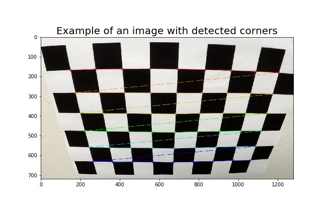
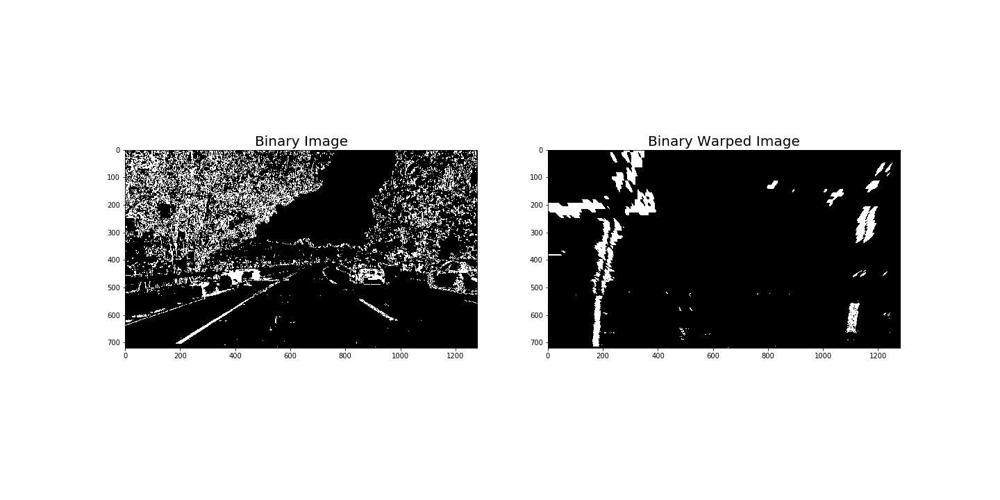
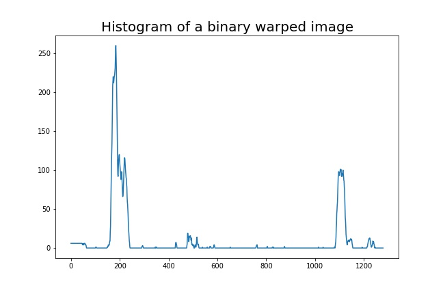
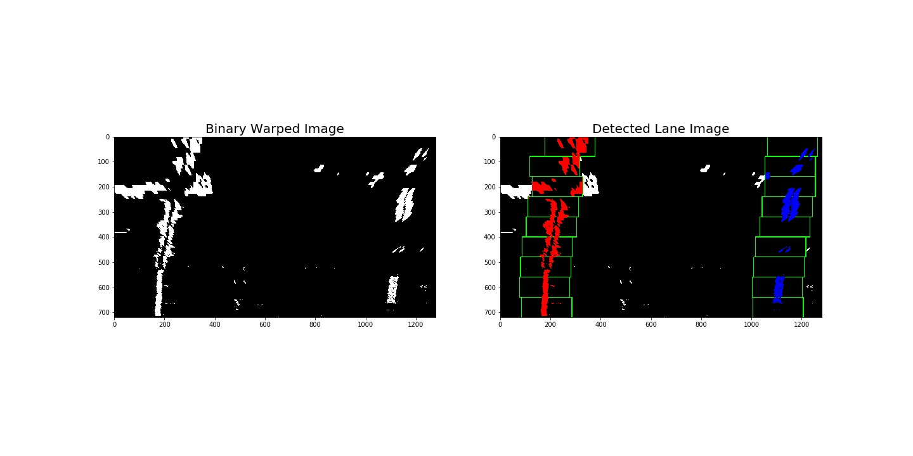
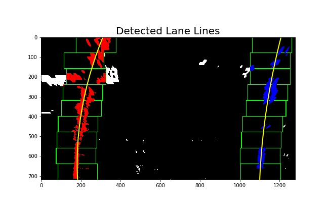
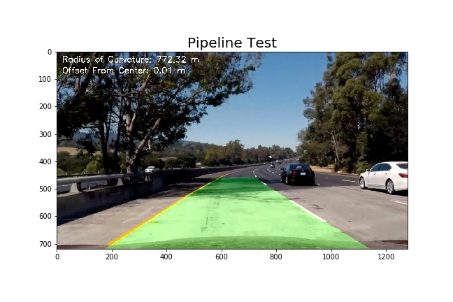

# **Advanced Lane Finding**

## Project Writeup

---

**Advanced Lane Finding Project**

The goals / steps of this project are the following:
* Compute the camera calibration matrix and distortion coefficients given a set of chessboard images.
* Apply a distortion correction to raw images.
* Use color transforms, gradients, etc., to create a thresholded binary image.
* Apply a perspective transform to rectify binary image ("birds-eye view").
* Detect lane pixels and fit to find the lane boundary.
* Determine the curvature of the lane and vehicle position with respect to center.
* Warp the detected lane boundaries back onto the original image.
* Output visual display of the lane boundaries and numerical estimation of lane curvature and vehicle position.

The actual project code with solution is provided in the IPython notebook [advanced_lane_finding.ipynb](advanced_lane_finding.ipynb).

---

## Rubric Points
### Here I will consider the [rubric](https://review.udacity.com/#!/rubrics/571/view) points individually and describe how I addressed each point in my implementation.  

---

### Camera Calibration

#### 1. Briefly state how you computed the camera matrix and distortion coefficients. Provide an example of a distortion corrected calibration image.

The code for this step is contained in the code cell `[2]` of the IPython notebook [advanced_lane_finding.ipynb](advanced_lane_finding.ipynb). The code calculates the camera matrix and distortion coefficients using the images in the `camera_cal/` folder. It was adopted from original Udacity [source](https://github.com/udacity/CarND-Camera-Calibration).

I start by preparing "object points", which will be the (x, y, z) coordinates of the chessboard corners in the world. Here I am assuming the chessboard is fixed on the (x, y) plane at z=0, such that the object points are the same for each calibration image. Thus, `objp` is just a replicated array of coordinates, and `objpoints` will be appended with a copy of it every time I successfully detect all chessboard corners in a test image. `imgpoints` will be appended with the (x, y) pixel position of each of the corners in the image plane with each successful chessboard detection. I used OpenCV library to extract object points `objpoints` and image points `imgpoints` needed for camera calibration. I saved the camera calibration matrix and distortion coefficients in file `camera_cal/dist_pickle.p` and in the instance of the 'Line()' class.

Here is an example of a chessboard image with detected corners:

In 3 images the corners could not be detected because the number of cross points is not corresponding to the defined values of nx = 9 and ny = 6. I will use those images to test undistortion.

Then I applied this distortion correction to the test image using the cv2.undistort() function. 

First I tested distortion correction on a chessboard image:

And then it was applied to the test images (see below)

### Pipeline (single images)

#### 1. Provide an example of a distortion-corrected image.

Here is an example of the distortion correction applied to one of the test images:

#### 2. Describe how (and identify where in your code) you used color transforms, gradients or other methods to create a thresholded binary image. Provide an example of a binary image result.

I used a combination of color and gradient thresholds to generate a binary image (code cell `[7]`). Here's an example of my output for this step:

#### 3. Describe how (and identify where in your code) you performed a perspective transform and provide an example of a transformed image.

The code for my perspective transform is in cells `[8], [9] and [10]` of the IPython notebook. 
First I put mark lines on top of the lane lines to find source points (corners) for the perspective transform. I used an image with straight lanes to check if the output lines were drawing a rectangle.

I chose the source points as the end points of the drawn lines. The destination points are the outer corners of the image minus an offset of 200 pixels. The order of the corners is `top-left->top-right->bottom-right->bottom-left`. This resulted in the following source and destination points:

| Corner | Source (x,y) | Destination (x,y) | 
|:-------|:------:|:-----------:| 
|Top-Left|578, 460|200, 0|
|Top-Right|705, 460|1080, 0|
|Bottom-Right|1120, 720|1080, 720|
|Bottom-Left|195, 720|200, 720|

I verified that my perspective transform was working as expected by drawing the src and dst points onto a test image and its warped counterpart to verify that the lines appear parallel in the warped image:

Then I tested it on a binary thresholded image of curved lanes:

#### 4. Describe how (and identify where in your code) you identified lane-line pixels and fit their positions with a polynomial?

Then I used a method of taking peaks in a histogram to find the lane lines on the binary warped image and to fit the lines with a 2nd order polynomial. The related code could be found in cells `[12],[13]and[14]` of the IPython notebook.

First I took a histogram along all the columns in the lower half of a binary warped image:

The two most prominent peaks in the histogram indicated the x-position of the base of the lane lines. I use that as a starting point for where to search for the lines. From that point I used a sliding window, placed around the line centers, to find and follow the lines up to the top of the frame:

After fitting the extracted lines with the second order polinominal the resulted curved line looked like this:

#### 5. Describe how (and identify where in your code) you calculated the radius of curvature of the lane and the position of the vehicle with respect to center.

Calculation of the  radius of curvature of the lane and the position of the vehicle with respect to center is done in code cells `[17],[18]and[19]` of the IPython notebook. I used the formula provided in the class for the calculation. First I calculated the radius of curvature in the pixel space and then scaled the measurements to the warld space (meters) with the following scale parameters: `30 meters per 720 pixels in y dimension` and `3.7 meters per 700 pixels in x dimension`

To calculate the vehicle position I defined a camera position in the middle of the binary warped image. Then I took a mean value of the base points of the detected lines at the bottom of the image as a center of the lane. The difference between the camera position and the lane center, scaled to meters, gave me the offset of the vehicle position.

#### 6. Provide an example image of your result plotted back down onto the road such that the lane area is identified clearly.

The next step was to plot the detected lane on the original image. It is done in the code cell `[20]` of the notebook. I mapped the lane image on the warped image first and then used the inversed perspective transfor to put it back on the undistorted original image of the road. Here is an example of my result on a test image:

### Pipeline (video)

#### 1. Provide a link to your final video output. Your pipeline should perform reasonably well on the entire project video (wobbly lines are ok but no catastrophic failures that would cause the car to drive off the road!).

The video pipeline code is in cell `[21]` of the notebook. The pipeline processes each video frame as following:
* Removes distortion
* Creates a thresholded binary image
* Transforms to a top-down view
* Detects the lane lines
* Wraps the lane back to the original image
* Calculates the curvature and camera offset from the center of the lane

Here's a link to my final output video [project_video_output.mp4](project_video_output.mp4)

### Discussion

#### 1. Briefly discuss any problems / issues you faced in your implementation of this project. Where will your pipeline likely fail? What could you do to make it more robust?

The techniques in the project are taken directly from the class lessons. It covers just the basics and it was not tested in low light conditions or on a road with only one left line ceparating the traffic direction. Also it was not tested on the traffic lanes separated by double lines.

I believe there is plenty of room for improvement if I was going to pursue this project further. First I would spend more time on creating tresholded binary images by using more challenging images with not clear lane lines. Second I would use better filters to smooth the video with detected lines. And finaly I would change the structure of the project by creating separate python modules responsible for different image processing steps and importing the modules to the IPython notebook. Also my Line() class is missing a proper constructor, sanity check and access methods.   
